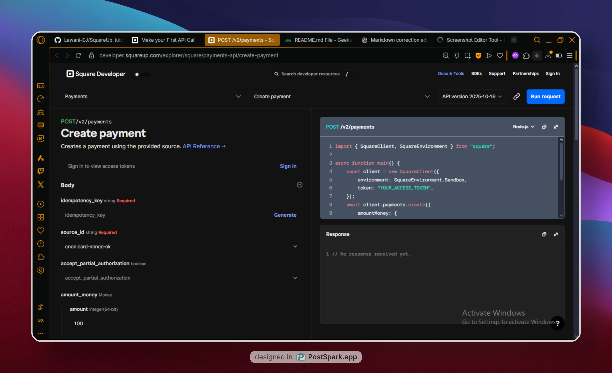
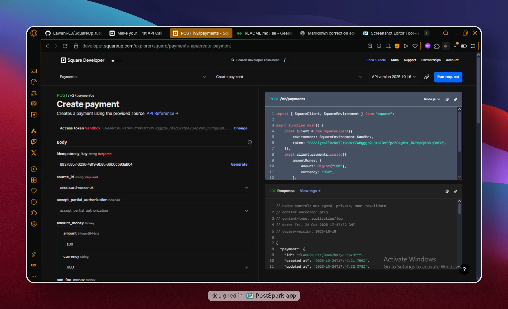
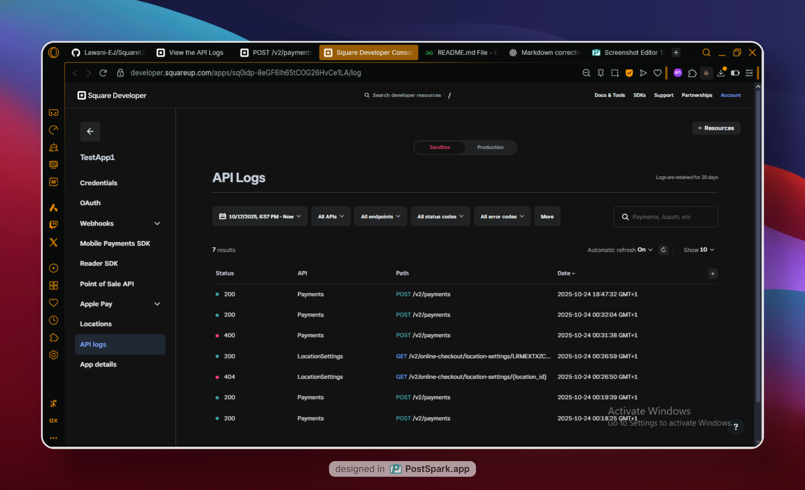
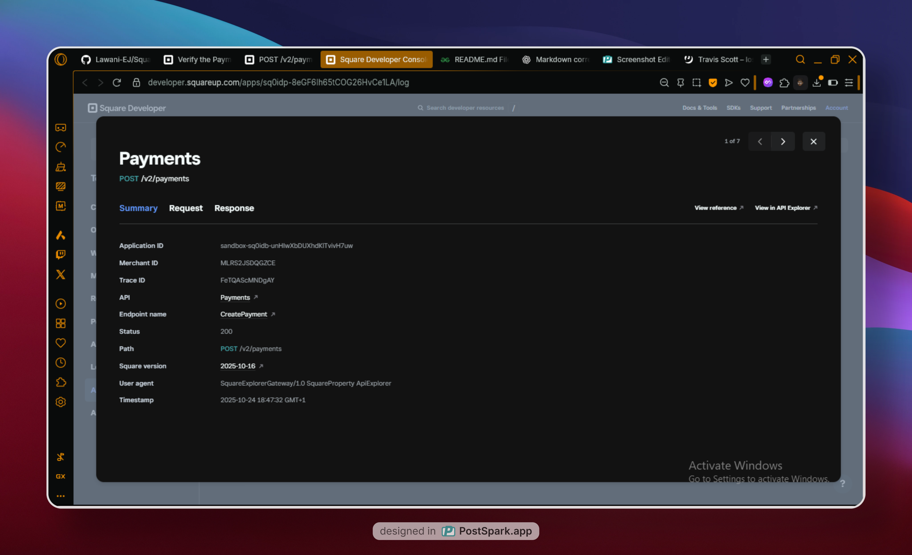
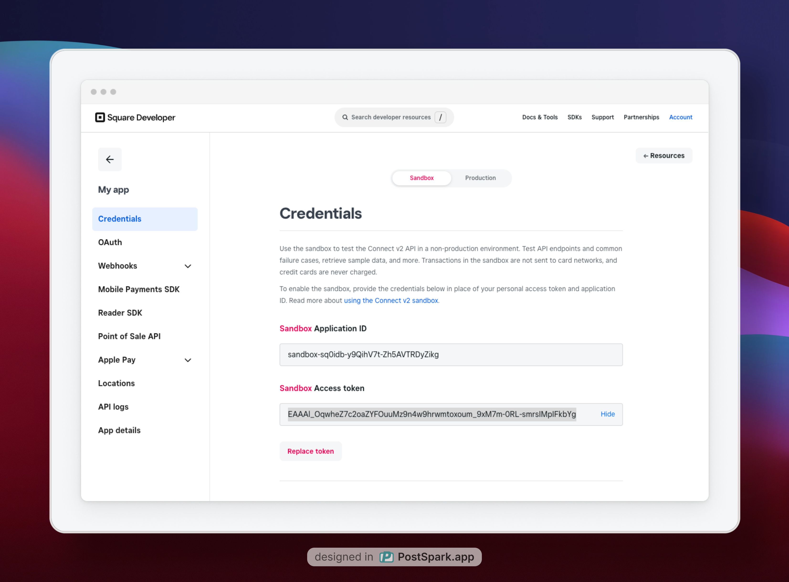

# Overview of SquareUP

## Task 1
- [x] **Create your account**

  To start building on the Square Developer platform, create a free Square developer account.  
  The sign-up process involves a short series of prompts that collect information to create your account and register your first application.

## Task 2
- [x] **Making the first API call**

After you create an account and application ,you can use API Explorer to call Square APIs. This exercise creates a payment in the 
Square Sandbox.



- In API Explorer, choose Run Request.
- Review the Request and Response panes:
    - The Request pane shows the request that was sent. You can change the default cURL view to see the request in another programming language.
    
    - The Response pane shows the response from Square. If the payment is successful, Square returns a Payment object with the status field set to COMPLETED. If the request failed, Square returns an error.



The source_id in the request is a Sandbox payment token
 that represents a credit card. In production, payment tokens are generated by the Web Payments SDK
 or In-App Payments SDK
.

## Task 3
- [x] **Viewing the API Logs**
You can view API logs: 
 for your application in the Developer Console.

 - In the Response pane of your the API call
 in API Explorer, choose View Logs. This opens the Developer Console to the API Logs page for your application.

- Choose the API call from the results list.

- To view the HTTP request, choose Request.

- To view the response, choose Response.






# Day 2
- [x] The building basics with square
The following design concepts and patterns are useful to understand as you develop applications on the Square Developer platform:
1. Versioning in Square API's
2. Access Tokens and Other Square Credentials
3. Frontend and Backend Development (I like this one)
4. General Development Concepts.
5. Common Data Types
6. Common Square API Patterns.
7. Square eCommerce APIs
8. Square API Lifecycle

# Day 3
## Versioning in the square API:  
Describes versioning and version-naming schemes used for the Square API and SDKs. The Square API uses a ```YYYY-MM-DD``` version-naming scheme that indicates the date the API version is released. This versioning scheme is used to control breaking changes and allows you to test newer API versions before upgrading your application. The API version applies to all Square APIs, such as the Payments API, Orders API, and Customers API.

Each application registered in the Developer Console has a default API version, which you can view or change on the Credentials page for the production or Sandbox environment. The default API version is pinned to the application and used for all API requests unless overridden in the Square-Version header.

The following request omits the Square-Version header, which directs Square to use the default API version:

``` bash
curl https://connect.squareup.com/v2/payments \
  -H 'Authorization: Bearer {ACCESS_TOKEN}' \
  -H 'Content-Type: application/json'
```

To override the default and test different API versions, explicitly specify the API version in the Square-Version header (or corresponding SDK client parameter):

``` bash 
curl https://connect.squareup.com/v2/payments \
  -H 'Square-Version: 2024-07-17' \
  -H 'Authorization: Bearer {ACCESS_TOKEN}' \
  -H 'Content-Type: application/json'
```

# Day 4
Access Tokens and Other Square Credentials
Access tokens are credentials that allow applications to securely interact with Square APIs. An access token authenticates your application and authorizes access to resources in a Square account, such as customers, orders, and payments. Proper credential management and storage is critical for maintaining security.

## Access Token types
1. Personal access tokens: Provides unrestricted Square API access to resources in a Square account. You can use your personal access token in Square API calls to perform any activity on any resource in your own Square account.

2. OAuth access tokens: Provides authenticated and scoped Square API access to resources in a Square account. Applications use OAuth access tokens in Square API calls to access resources on behalf of account owners. When Square sellers sign up to use an application, they grant the specific permissions (scopes) that the application needs to perform some activity on their account resources.


# Day 5
## Get a personal access token
Each application created in the Developer Console provides a personal access token for use in the production environment and a separate Sandbox access token for use in the Square Sandbox.

1. Sign in to the Developer Console
 and open the application that's calling the Square APIs. If needed, follow the steps in Get Started to create a Square account and an application.
2. In the left pane, choose Credentials.
3. Get your production or Sandbox access token.




Guidelines that apply to protecting access tokens
- Don't hardcode access tokens in your code
- Don't share access tokens


# Day 6
## Getting an OAuth access token
An OAuth is a security standard that allows third-party applications to access a user's data from another service without the user having to share their password.

The process of getting an OAuth token depends on the application type (which determines wether you use the code flow or PKCE flow) and wether the token is used production or for testing in the square sandbox during development..

## Production type:
In production applications start the OAuth flow by sending each seller to the square authorization page. On a succesful flow completion, square returns an OAuth access token to your application.
The OAuth flow includes the following high level stages.

1. Stage 1:
Your application uses an authorization URL to send the seller to the square authorization page where they can sign into square and grant the permissions you requested.

2. Stage 2: 
Square uses your redirect URL to send the seller back to your application and appends a code query parameter that contains an authorization code.

3. Stage 3:
Your application calls `ObtainToken` and sends the authorization code, your application ID, and other fields. Square returns an access token and refresh token.

## Sandbox type:
Testing in sandbox lets you verify that your application can successfully access and manage resources in a Square account and gracefully handle authorization errors. There are two options for getting access tokens:

1. Stimulate the OAuth Flow: 
You can stimulate the OAuth flow in the Sandbox.

2. Generate OAuth access tokens:
If your'e not ready to add an OAuth flow. You can quickly generate the Sandbox OAuth access tokens to try calling Square API's with a specific set of permissions.

# Day 7
## Frontend and Backend Development
A typical application has a frontend client and backend server
1. Frontend: Provides a UI that displays the information, recieves the user input (using buttons, menus, and other UI elements) and interacts with the application backend

2. Backend: Recieves and processes the user's input sent from the frontend, pulls the necessary data from the internal and external sources, and sends the data back to the frontend.  The backend is typically built using server-side languages and frameworks such as PHP, Java, Node.js, or Python.

Square provides payment API's and SDK's that support payment processing activites from the frontend and backend.

# Frontend
A payment-processing flow usually starts with a buyer providing payment information in the application frontend (for example, entering card information in text boxes)

Application frontends can use client-side payment API's and SDK's for payment processing activites. These libararies provide UI elements used to collect payment information for online payments or Square hardware.

## Online payments 
For online payments, the following client-side libraries are used with backend calls to the Payments API:

1. Web Payments SDK - Used to process payments in web applications.
2. In-App Payments SDK - Used to process payments in mobile seller applications that buyers install on their Android or iOS devices.

## Payments on hardware
For in-persons payments on Square hardware, the following client-side libraries are used to process payments end to end. No backend square API calls are required.

1. Mobile Payments SDK - Used to process payments with Square Reader devices or Square Stand. Developers can embed the Mobile Payments SDK in their mobile application.

2. Point of Sale API - Used to process payments with Square Reader from a developer's mobile application.Developers can embed the Point of Sale API in their mobile application, and the API acts as an application switcher. When a payment is ready to be processed, the API switches to the Square Point of Sale application and collects the payment with the Square Reader.

# Day 8
# Backend
Square API's integrate with backend development. Typically, the application backend sends API requests to Square and processes the responses. Application backends can call Square API's directly using any programming language or use a Square SDK in a supported programming language.

Many Square API's integrate with other Square API's for basic or extended functionallity. For example, many operations require a location ID that can be retrieved using the Merchants API or locations API.

The following are some commomly used Square API's:
1. Payment API - Process Payments using payment tokens (generated by the client-side Web Payments SDK and In-App Payments SDK) or credit card, and gift card ID's (retrived using the Customer's API, Cards's API and Gift Card's API).
